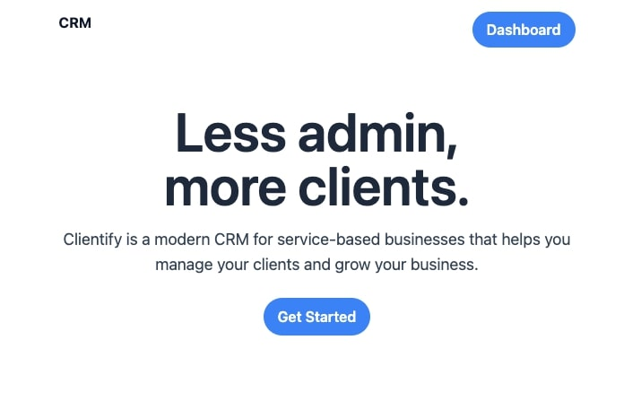
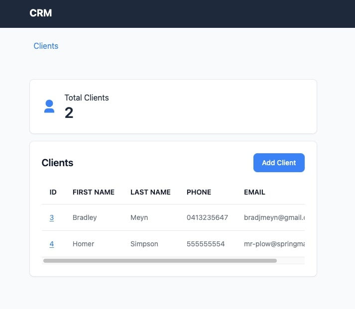
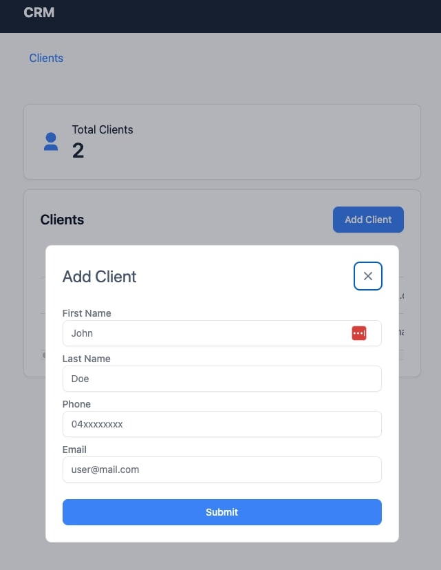
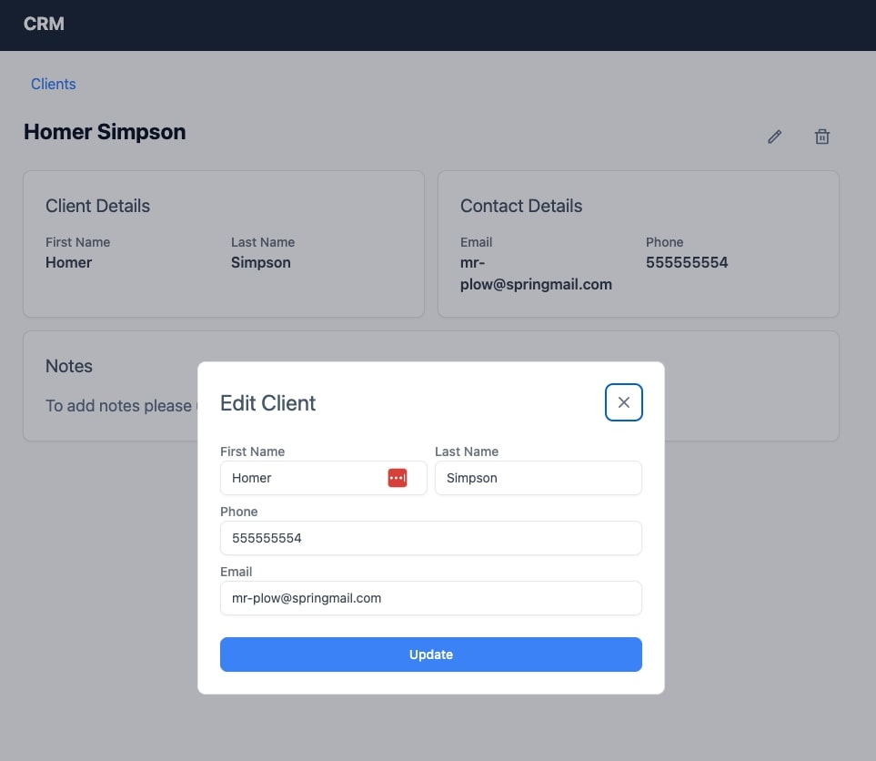

# Client App

## Description

Client app for BMT Tax Depreciation. Many flaws/things I didn't have time to implement, most notably UI updates for server data changes. I wanted to try Tanstack Query for this but didn't have time to implement it.

## Technologies

- React (Vite)
- Tanstack Router
- React Hook Form
- TypeScript
- Tailwind CSS
- .NET 8.0 (API)
- PostgreSQL (Database)

## Screenshots

### Landing Page

### Clients Page

### Add Client Page

### Edit Client Page

